# Virtual Store

### TERCERA ENTREGA 3️⃣

### Desafio - Ecoomerce Backend


  

Repositorio con el proyecto de ecommerce, realizado para la carrera FullStack de CoderHouse

  

## Table de contenidos ✨

  

- [Vision General](#vision-general-📑)

- [Funcionamiento](#funcionamiento-⚙)

- [Desafio](#desafio-🏅)

- [Estructura](#estructura-🧷)

- [Links](#links-🔗)

  

- [Proceso](#proceso-🔨)

  

- [Proyecto](#proyecto-🌍)

  

- [Que aprendi](#que-aprendi-💡)

  

- [Recursos utiles](#recursos-utiles-🔔)

  

- [Autor](#autor-😎)

  

## Vision General 📑

### Funcionamiento ⚙

Para correr el Sistema  debemos instalar los modulos en caso de no contar con ellos, los toma todos desde el package.json
```
    npm install
```
una vez que tenemos todas las dependencias solo quedar correr el servidor, ubicados en la carpeta "/server"
```
    npm start
    o
    node server.js
```
  recibiremos el mensaje
  
```
    Servidor escuchando en el PUERTO:8080 - PID WORKER:XXXX
```

-> dentro del archivo .env, podemos cambiar de modo **FORK** a **CLUSTER**

   que nos indica que todo esta correcto, para ingresar al sistema solicitamos en el navegador 
   
```
    http://localhost:8080/
```

### Desafio 🏅

  

El Usuario debería ser capaz de:

  

- Ver el diseño de manera optioma en ambas pantallas, escritorio y mobil.

  

- Ver todos los movimientos interactivos sobre los botones

### Estructura 🧷

```bash
Client -> Proyecto completo en React
Server -> Servidor Node + Build Front End
```

### Links 🔗

  

**HEROKU**

- URL del Sitio en Vivo: [Demo en HEROKU](https://gabriel-ecommerce.herokuapp.com/) 👀

  

## Proceso 🔨

  

### Proyecto 🌍

Etapa 3

**Consigna 1 - 📣**

**Un menú de registro y autenticación de usuarios basado en passport local, guardando en la base de datos las credenciales y el resto de los datos ingresados al momento del registro.**

El registro de usuario consiste en crear una cuenta en el servidor almacenada en la base de datos, que contenga el email y password de usuario, además de su nombre, dirección, edad, número de teléfono (debe contener todos los prefijos internacionales) y foto ó avatar. La contraseña se almacenará encriptada en la base de datos.

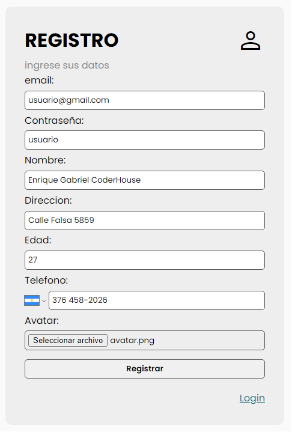

La imagen se podrá subir al servidor y se guardará en una carpeta pública del mismo a la cual se tenga acceso por url.

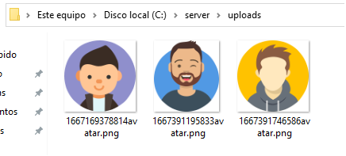

Base de datos Mongo DB

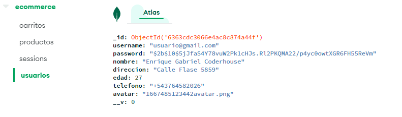


**Consigna 2 - 📣**

**Un formulario post de registro y uno de login. De modo que, luego de concretarse cualquiera de estas operaciones en forma exitosa, el usuario accederá a su home.**

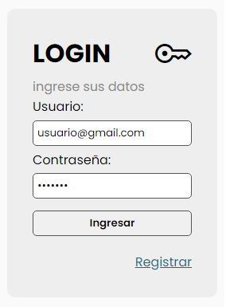

El usuario se logueará al sistema con email y password y tendrá acceso a un menú en su vista, a modo de barra de navegación. Esto le permitirá ver los productos totales con los filtros que se hayan implementado y su propio carrito de compras e información propia (datos de registro con la foto). Además, dispondrá de una opción para desloguearse del sistema.

**Barra de Navegacion:**

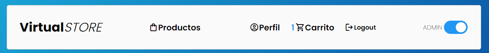

**Vista de Home:**

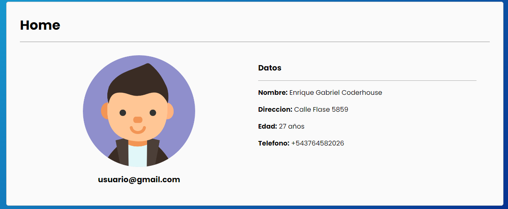

Ante la incorporación de un usuario, el servidor enviará un email al administrador con todos los datos de registro y asunto **'nuevo registro'**, a una dirección que se encuentre por el momento almacenada en una constante global.

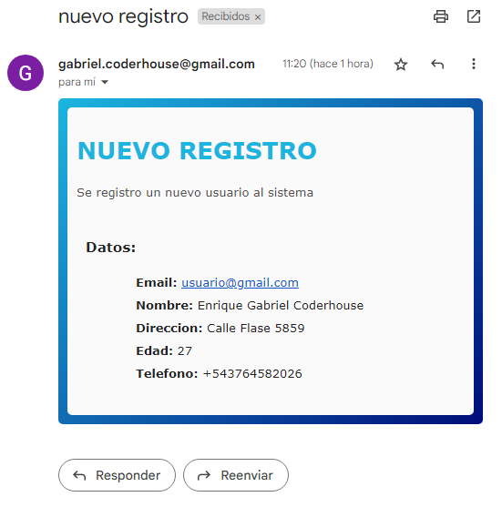
  
 **Consigna 3 - 📣**

**Envío de un email y un mensaje de whatsapp al administrador desde el servidor, a un número de contacto almacenado en una constante global.**

El usuario iniciará la acción de pedido en la vista del carrito.

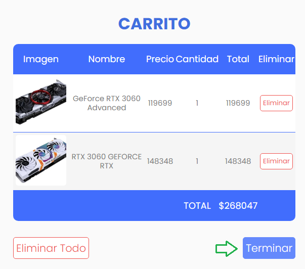

Será enviado una vez finalizada la elección para la realizar la compra de productos.
El email contendrá en su cuerpo la lista completa de productos a comprar y en el asunto la frase **'nuevo pedido de'**  y el **nombre** y **email** del usuario que los solicitó. 

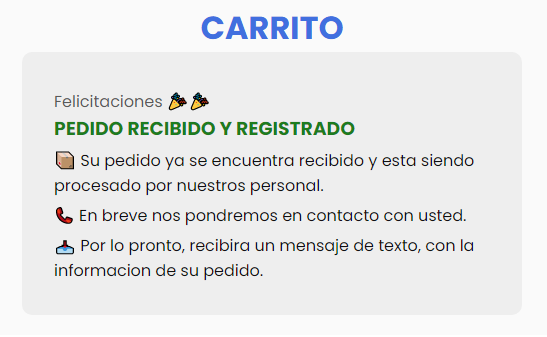

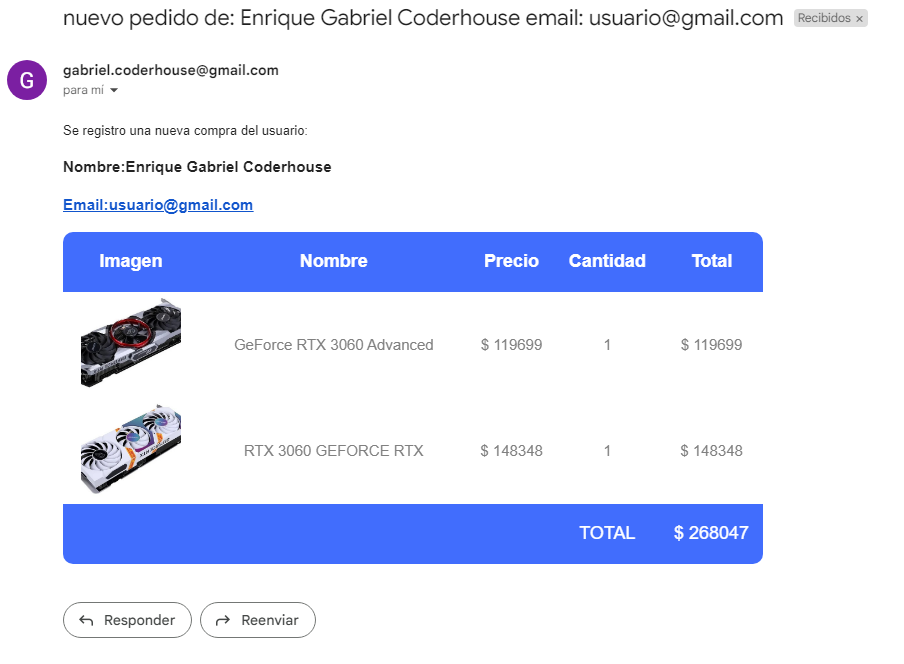

En el mensaje de whatsapp se debe enviar la misma información del asunto del email.

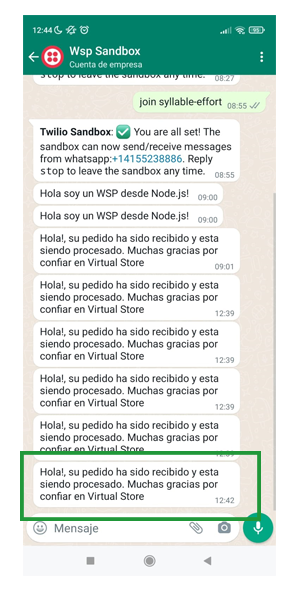

El usuario recibirá un mensaje de texto al número que haya registrado, indicando que su pedido ha sido recibido y se encuentra en proceso.

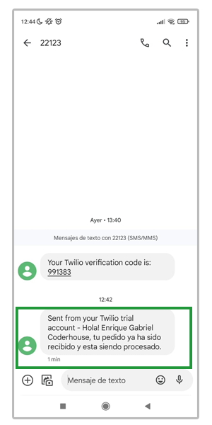

```diff
- Los mensajes de texto o whatsapp NO se pueden enviar a numeros que no esten registrados dentro de Twilio, mientras que la cuenta sea de modalidad FREE 
```


 **Aspectos a Incluir - 📣**
 
El servidor trabajará con una base de datos DBaaS (Ej. **MongoDB Atlas**) y estará preparado para trabajar en forma local o en la nube a través de la plataforma PaaS **Heroku**.

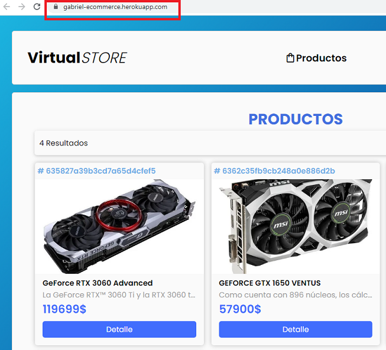

Habilitar el modo **cluster** para el servidor, como opcional a través de una constante global.

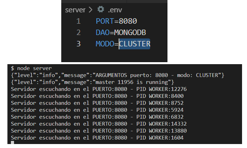

Utilizar alguno de los loggers ya vistos y así reemplazar todos los mensajes a consola por logs eficientes hacia la misma consola. En el caso de errores moderados ó graves el log tendrá además como destino un archivo elegido.

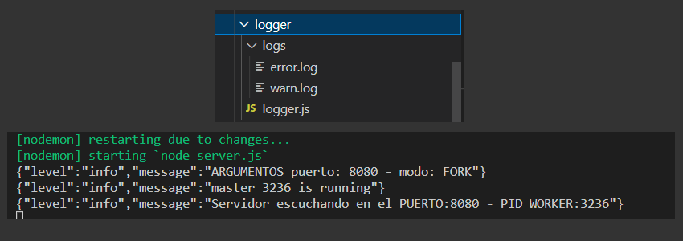

Realizar una prueba de performance en modo local, con y sin cluster, utilizando Artillery en el endpoint del listado de productos (con el usuario vez logueado). Verificar los resultados.

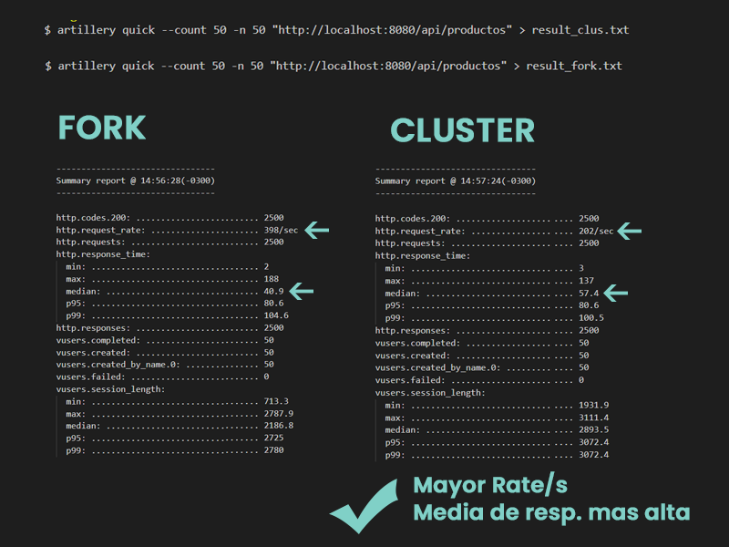

### Que aprendí 💡

- Como manejar Sessiones con **passport** usando **Strategies** y las sessiones de express con "**express-session**".
- Como encriptar datos con **bcrypt**.
- Subir archivos al servidor mediante "**multer**".
- Uso de la librería "**react-phone-number-input**" para la creacion de un input interactivo.
- Uso de las herramientas de **Twilio** para enviar mensajes de texto SMS y mensajes online via Whatsapp.
- Utilizacion de **Nodemailer** para enviar correos desde nuestro servidor con un correo propio de **gmail** o con uno falso de **ethereal.mail**.
- Utilizacion de DbaaS, en preferencia con **MongoAtlas**.
- Balance de carga con el metodo **cluster**.
- Mejorar el rendimiento de los Log, con apis asyncronicas como **Winston**.
- Pruebas de carga con herramientas como **Artillery** y analisis de resultados.
 

### Recursos Utiles 🔔

  

- [w3schools](https://www.w3schools.com/css/) - Esta pagina es escencial para aprender lo basico de HTML, CSS y JS.
  

- [Mdn Mozilla developer Network](https://developer.mozilla.org/es/docs/Web/CSS/CSS_Grid_Layout) - MDN es el sitio de documentacion STANDART.
- [Node v.16 ](https://nodejs.org/dist/latest-v18.x/docs/api/) - Entorno de desarrollo 
- [React v.18](https://es.reactjs.org/docs/getting-started.html) - Entorno de FrontEnd
- [Express Js v4.18](https://expressjs.com/es/starter/installing.html) - Ruteo de peticiones
- [MonogoDB v.6](https://www.mongodb.com/docs/) - Base de datos NO relacional


  

## Autor 😎

  
 

- Linkedin - [in/gabriel-teresczuk](https://www.linkedin.com/in/gabriel-teresczuk/)